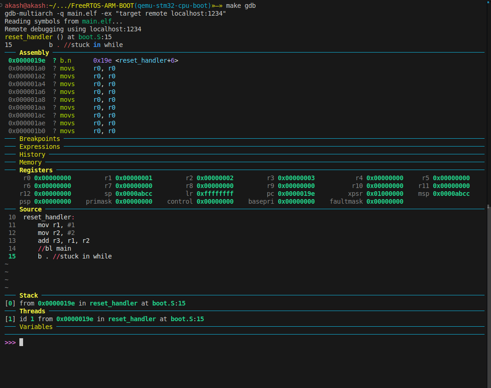

# ⚡ Embedded ARM Setup Guide

##  Installation Packages
```bash
sudo apt-get install gdb-multiarch
```
```bash
pip3 install pygments --break-system-packages
wget -P ~ https://git.io/.gdbinit
```

## Goto the specific directory
```bash
cd $(your_path)/ARM-BOOT-BASICS/FreeRTOS-ARM-BOOT
make
make qemu
```
## Open another terminal
```bash
make gdb
```
## Sample Snippet
